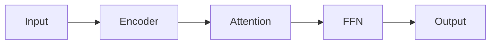
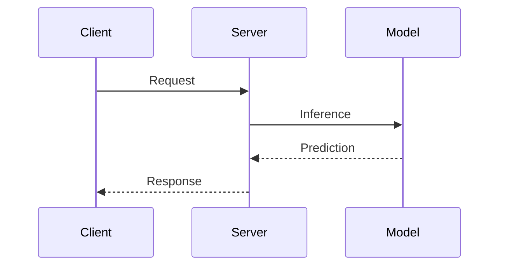

<div align="center">

# rohit.vision/blogs

**Technical blog for AI/ML deep dives — math, code, interactive visualizations, and more.**

[](https://github.com/rokmr/blogs/actions/workflows/deploy.yml)
[](https://jekyllrb.com/)
[](https://katex.org/)
[](#license)

[**Live Site →**](https://rohit.vision/blogs) · [**Docs →**](https://rohit.vision/blogs/docs/) · [**Examples →**](https://rohit.vision/blogs/examples/)

</div>

---

## Table of Contents

- [Features Overview](#-features-overview)
- [Quick Start](#-quick-start)
- [Project Structure](#-project-structure)
- [Writing Content](#-writing-content)
  - [Posts](#posts)
  - [Notes](#notes)
- [Documentation Features](#-documentation-features)
  - [LaTeX Math (KaTeX)](#1-latex-math-katex)
  - [Code Blocks & Syntax Highlighting](#2-code-blocks--syntax-highlighting)
  - [Interactive / Runnable Code](#3-interactive--runnable-code)
  - [Collapsible Code](#4-collapsible-code)
  - [Mermaid Diagrams](#5-mermaid-diagrams)
  - [Images](#6-images)
  - [Image Comparison Slider](#7-image-comparison-slider)
  - [Video Embeds](#8-video-embeds)
  - [HuggingFace Space Embeds](#9-huggingface-space-embeds)
  - [Callout Blocks](#10-callout-blocks)
  - [Citations & Bibliography](#11-citations--bibliography)
  - [Cross-References](#12-cross-references)
  - [Inline Formatting](#13-inline-formatting)
  - [Slide Viewer (PDF)](#14-slide-viewer-pdf)
  - [Tables](#15-tables)
  - [Breadcrumb Navigation](#16-breadcrumb-navigation)
- [Sidebar & Quick Actions](#-sidebar--quick-actions)
- [Semantic Search](#-semantic-search)
- [Comments & Reactions (Giscus)](#-comments--reactions-giscus)
- [Presentation Mode & PDF Export](#-presentation-mode--pdf-export)
- [Knowledge Graph & Backlinks](#-knowledge-graph--backlinks)
- [Frontmatter Reference](#-frontmatter-reference)
- [Configuration](#-configuration)
- [Local Development](#-local-development)
- [Deployment](#-deployment)
- [License](#license)

---

## ✨ Features Overview

| Category | Features |
|---|---|
| **Math** | KaTeX (inline & display), numbered equations, equation references |
| **Code** | Prism.js syntax highlighting, interactive runnable code (Pyodide), collapsible blocks, line numbers |
| **Diagrams** | Mermaid.js (flowcharts, sequence, state, class, ER, Gantt, pie charts) |
| **Images** | Single / two-column / grid layouts, lightbox, image comparison slider |
| **Embeds** | YouTube / Vimeo videos, HuggingFace Spaces, PDF slide viewer |
| **Callouts** | 17 types — note, tip, warning, danger, theorem, definition, proof, example, etc. |
| **Academic** | BibTeX citations, cross-references (figures, tables, equations, sections), bibliography |
| **Formatting** | Highlights, keyboard shortcuts, abbreviations, small caps |
| **Search** | AI-powered semantic search (Transformers.js) with keyword fallback |
| **Navigation** | Auto-generated TOC, breadcrumbs, prev/next notes, backlinks, knowledge graph |
| **Export** | PDF export, presentation mode |
| **Comments** | Giscus (GitHub Discussions) — reactions, threaded comments |
| **Collections** | Blog posts + structured notes organized by subject/topic |

---

## 🚀 Quick Start

```bash
# Clone the repository
git clone https://github.com/rokmr/blogs.git
cd blogs

# Install dependencies
bundle install

# Run dev server
bundle exec jekyll serve --baseurl ""

# Visit http://localhost:4000
```

---

## 📁 Project Structure

```
blogs/
├── _config.yml              # Site configuration
├── _data/
│   ├── bibliography.yml     # Global citation library
│   └── layout.yml           # Layout spacing/breakpoint config
├── _includes/
│   ├── breadcrumb.html      # Breadcrumb navigation
│   ├── giscus.html          # Giscus comments widget
│   ├── header.html          # Site header
│   ├── footer.html          # Site footer
│   ├── img.html             # Smart image include (single/row/grid)
│   ├── image-grid.html      # Image grid layout
│   ├── image-row.html       # Two-column image layout
│   ├── page-header.html     # Page header
│   └── references.html      # References/bibliography section
├── _layouts/
│   ├── default.html         # Base layout (loads all JS/CSS)
│   ├── home.html            # Home page
│   ├── post.html            # Blog post layout
│   ├── note.html            # Note layout
│   ├── subject.html         # Subject index
│   └── sub-subject.html     # Sub-subject index
├── _posts/                  # Blog posts (YYYY-MM-DD-slug.md)
├── _notes/                  # Structured notes by subject
│   ├── cv/                  # Computer Vision
│   ├── deep-learning/       # Deep Learning
│   ├── maths/               # Mathematics
│   ├── ml/                  # Machine Learning
│   ├── mlops/               # MLOps
│   ├── nlp-llms/            # NLP & LLMs
│   ├── rl/                  # Reinforcement Learning
│   └── setup/               # Setup Guides
├── assets/
│   ├── css/main.css         # All styles
│   ├── js/                  # Modular JavaScript
│   │   ├── main.js          # Orchestrator
│   │   ├── toc.js           # Table of Contents
│   │   ├── callouts.js      # Callout blocks
│   │   ├── code-runner.js   # Interactive code (Pyodide)
│   │   ├── code-enhancements.js
│   │   ├── mermaid-init.js  # Mermaid diagrams
│   │   ├── citations.js     # Citation processing
│   │   ├── cross-references.js
│   │   ├── inline-formatting.js
│   │   ├── latex-enhancements.js
│   │   ├── image-compare.js # Before/after slider
│   │   ├── lightbox.js      # Image lightbox
│   │   ├── slide-viewer.js  # PDF slide viewer
│   │   ├── embeds.js        # HF/video embeds
│   │   ├── backlinks.js     # Backlink detection
│   │   ├── semantic-search.js
│   │   ├── pdf-export.js    # Export to PDF
│   │   ├── presentation.js  # Presentation mode
│   │   └── ...
│   ├── images/              # Blog images
│   └── resources/           # PDFs, slides, etc.
├── docs.md                  # Documentation page
├── examples.md              # Interactive feature showcase
├── search.html              # Search page
├── graph.html               # Knowledge graph
└── index.md                 # Home page
```

---

## ✍️ Writing Content

### Posts

Create files in `_posts/` with naming: **`YYYY-MM-DD-title-slug.md`**

```yaml
---
title: "Your Post Title"
date: 2024-12-17
tags: [transformers, attention, deep-learning]
math: true         # Enable KaTeX
comments: true     # Enable Giscus comments
citations:         # Per-post citations (optional)
  mykey2024:
    authors: "Author Name"
    title: "Paper Title"
    venue: "Conference 2024"
    year: 2024
    url: "https://..."
---

Your content here...
```

Posts are available at: `/posts/title-slug/`

### Notes

Create files in `_notes/<subject>/<topic>/` for hierarchical organization:

```yaml
---
title: "Note Title"
date: 2025-01-15
description: "Brief description"
tags: [tag1, tag2]
subject: rl
math: true
status: wip                  # Shows WIP badge (optional)
updated: 2025-01-20          # Last updated date (optional)
slides:                      # Attach PDF slides (optional)
  - title: "Lecture 01"
    url: "/assets/resources/notes/rl/CS224R/01.pdf"
references:                  # Manual references (optional)
  - title: "Paper Title"
    url: "https://..."
    authors: "Author Name"
    venue: "Conference"
    year: 2025
citation_refs:               # Reference global bibliography keys
  - vaswani2017attention
  - sutton2018reinforcement
---

Your note content here...
```

Notes are available at: `/notes/<subject>/<topic>/<filename>/`

---

## 📚 Documentation Features

### 1. LaTeX Math (KaTeX)

Fast client-side math rendering with KaTeX. Enabled when `math: true` in frontmatter.

**Inline Math:**
```markdown
The equation $E = mc^2$ shows mass-energy equivalence.
```
> Renders: The equation $E = mc^2$ shows mass-energy equivalence.

**Display Math:**
```markdown
$$
\int_{-\infty}^{\infty} e^{-x^2} dx = \sqrt{\pi}
$$
```

**Numbered Equations with References:**
```markdown
$$
\nabla \cdot E = \frac{\rho}{\epsilon_0} \label{eq:gauss}
$$

Gauss's law \eqref{eq:gauss} states that...
```

**Supported delimiters:**
| Delimiter | Type |
|---|---|
| `$...$` | Inline math |
| `$$...$$` | Display math |
| `\(...\)` | Inline math |
| `\[...\]` | Display math |

---

### 2. Code Blocks & Syntax Highlighting

Powered by **Prism.js** with the Tomorrow Night theme. Supports Python, Bash, YAML, JSON, and more. Line numbers are enabled globally.

````markdown
```python
import torch
import torch.nn as nn

class Attention(nn.Module):
    def __init__(self, d_model: int):
        super().__init__()
        self.scale = d_model ** -0.5
    
    def forward(self, q, k, v):
        scores = torch.matmul(q, k.transpose(-2, -1)) * self.scale
        return torch.matmul(scores.softmax(dim=-1), v)
```
````

````markdown
```bash
# Shell commands
pip install torch transformers
python train.py --epochs 10 --lr 3e-4
```
````

````markdown
```yaml
# Configuration files
model:
  name: "gpt2"
  layers: 12
  heads: 12
```
````

---

### 3. Interactive / Runnable Code

Code that runs **directly in the browser** via Pyodide (Python WASM). Includes a CodeMirror editor for editing.

```html
<div class="runnable" data-lang="python" markdown="1">

```python
import numpy as np

x = np.linspace(0, 2 * np.pi, 100)
print(f"Sum of sin(x): {np.sum(np.sin(x)):.4f}")
print(f"Max of cos(x): {np.max(np.cos(x)):.4f}")
```

</div>
```

> Users can edit and re-run the code. NumPy and other pure-Python packages are available.

---

### 4. Collapsible Code

Hide lengthy implementations behind a toggle:

```html
<div class="collapsible" data-label="Show Full Implementation" markdown="1">

```python
class TransformerBlock(nn.Module):
    def __init__(self, d_model, n_heads, d_ff, dropout=0.1):
        super().__init__()
        self.attention = MultiHeadAttention(d_model, n_heads, dropout)
        self.norm1 = nn.LayerNorm(d_model)
        self.ffn = nn.Sequential(
            nn.Linear(d_model, d_ff),
            nn.GELU(),
            nn.Linear(d_ff, d_model)
        )
        self.norm2 = nn.LayerNorm(d_model)
```

</div>
```

---

### 5. Mermaid Diagrams

Create diagrams using [Mermaid.js](https://mermaid.js.org/) syntax inside fenced code blocks:

````markdown

````

````markdown

````

**Supported diagram types:** Flowchart, Sequence, State, Class, ER, Gantt, Pie, Git Graph, and more.

---

### 6. Images

Flexible image layouts using the `img.html` include. Supports single, two-column, and grid layouts with optional captions.

**Single Image:**
```liquid

```

**Two-Column (side by side):**
```liquid

```

**Grid Layout (3+ images):**
```liquid

```

**Standard Markdown images also work:**
```markdown

```

> All images support **lightbox** — click any image to view fullscreen.

---

### 7. Image Comparison Slider

Interactive before/after slider for comparing images:

```html
<div class="image-compare" 
     data-before="/assets/images/attention_before.png" 
     data-after="/assets/images/attention_after.png">
  <span class="compare-label-before">Raw</span>
  <span class="compare-label-after">Processed</span>
</div>
```

---

### 8. Video Embeds

Embed videos from YouTube, Vimeo, or local MP4 files:

```html
<!-- YouTube -->
<div class="video-embed" 
     data-src="https://www.youtube.com/watch?v=VIDEO_ID" 
     data-caption="Video title">
</div>

<!-- Vimeo -->
<div class="video-embed" 
     data-src="https://vimeo.com/VIDEO_ID" 
     data-caption="Demo video">
</div>

<!-- Local MP4 -->
<div class="video-embed" 
     data-src="/assets/videos/demo.mp4" 
     data-caption="Local demo">
</div>
```

---

### 9. HuggingFace Space Embeds

Embed interactive HuggingFace Spaces directly in posts:

```html
<div class="hf-space" data-src="owner/space-name" data-height="600"></div>
```

**Example:**
```html
<div class="hf-space" data-src="exbert-project/exbert" data-height="600"></div>
```

---

### 10. Callout Blocks

Obsidian-style callouts for structured content. 17 types available:

```markdown
> [!NOTE]
> General information or context.

> [!TIP]
> Helpful suggestions and best practices.

> [!WARNING]
> Important cautions to be aware of.

> [!DANGER]
> Critical warnings — proceed with caution.

> [!QUESTION]
> Questions, FAQs, or discussion prompts.

> [!THEOREM]
> For any bounded sequence, there exists a convergent subsequence.

> [!DEFINITION]
> A **metric space** is a set equipped with a distance function.

> [!PROOF]
> By contradiction, assume the opposite... ∎

> [!EXAMPLE]
> Consider $f(x) = x^2$ on the interval $[0, 1]$.

> [!ABSTRACT]
> Summary of the key findings and contributions.

> [!CRITICAL]
> Must-know information for correct implementation.

> [!SUCCESS]
> Positive outcomes and expected results.
```

**All available types:**

| Type | Use For |
|---|---|
| `NOTE` | General information |
| `TIP` | Helpful suggestions |
| `INFO` | Contextual info |
| `WARNING` | Cautions |
| `DANGER` | Critical warnings |
| `CAUTION` | Proceed carefully |
| `IMPORTANT` | Key points |
| `QUESTION` | Questions / FAQs |
| `ABSTRACT` | Summaries |
| `DEFINITION` | Formal definitions |
| `THEOREM` | Mathematical theorems |
| `LEMMA` | Supporting lemmas |
| `COROLLARY` | Derived results |
| `PROOF` | Mathematical proofs |
| `EXAMPLE` | Worked examples |
| `CRITICAL` | Critical information |
| `SUCCESS` | Positive outcomes |

---

### 11. Citations & Bibliography

Academic-style citations with auto-numbered references.

#### Global Bibliography

Define frequently-used citations in `_data/bibliography.yml`:

```yaml
vaswani2017attention:
  type: article
  authors: "Vaswani, A., Shazeer, N., Parmar, N., et al."
  title: "Attention Is All You Need"
  venue: "NeurIPS 2017"
  year: 2017
  url: "https://arxiv.org/abs/1706.03762"
  doi: "10.48550/arXiv.1706.03762"
```

#### Per-Post Citations

Add inline citations in frontmatter:

```yaml
---
citations:
  mykey2024:
    authors: "Author Name"
    title: "Paper Title"
    venue: "Conference 2024"
    year: 2024
    url: "https://..."
---
```

#### Usage in Markdown

```markdown
The transformer architecture [@vaswani2017attention] revolutionized NLP.
Multiple citations: [@devlin2019bert; @brown2020gpt3]
```

#### References via Frontmatter

```yaml
references:
  - title: "Lecture Video"
    url: "https://youtube.com/..."
    authors: "Author Name"
    venue: "CS224R Stanford"
    year: 2025

citation_refs:               # Pull from global bibliography
  - vaswani2017attention
  - sutton2018reinforcement
```

> References are auto-rendered at the bottom of posts/notes via `_includes/references.html`.

**BibTeX Export:** Every post has a "Copy BibTeX" button that generates a citation for the post itself.

---

### 12. Cross-References

Reference figures, tables, equations, code blocks, and sections by label.

#### Labeling

| Element | Syntax | Example |
|---|---|---|
| Figure | `{#fig:name}` | `{#fig:arch}` |
| Table | `{#tbl:name}` | `\| Header \|{#tbl:results}` |
| Equation | `\label{eq:name}` | `$$x^2 \label{eq:quad}$$` |
| Code | `{#code:name}` | `{#code:impl}` |
| Section | `{#sec:name}` | `## Title {#sec:methods}` |

#### Referencing

| Element | Syntax | Renders As |
|---|---|---|
| Figure | `{@fig:arch}` | "Figure 1" |
| Table | `{@tbl:results}` | "Table 1" |
| Equation | `\eqref{eq:quad}` | "(1)" |
| Section | `{@sec:methods}` | "Section 2" |

---

### 13. Inline Formatting

Special inline formatting extensions:

| Syntax | Result | Description |
|---|---|---|
| `==text==` | <mark>text</mark> | Highlight |
| `[[Ctrl+C]]` | <kbd>Ctrl</kbd>+<kbd>C</kbd> | Keyboard shortcut |
| `::GPU\|Graphics Processing Unit::` | <abbr title="Graphics Processing Unit">GPU</abbr> | Abbreviation with tooltip |
| `///Small Caps///` | <span style="font-variant: small-caps">Small Caps</span> | Small caps text |

---

### 14. Slide Viewer (PDF)

Embed interactive PDF slide viewers with navigation, zoom, fullscreen, and download.

#### Via Frontmatter (recommended)

```yaml
---
slides:
  - title: "Lecture 01 - Introduction"
    url: "/assets/resources/notes/rl/CS224R/01_cs224r_intro_2025.pdf"
  - title: "Supplementary Material"
    url: "/assets/resources/slides/supplement.pdf"
---
```

#### Via Inline HTML

```html
<div class="slide-viewer" 
     data-pdf="/assets/resources/slides/lecture.pdf" 
     data-title="My Slides">
</div>
```

#### Organized Slide Sections

```yaml
---
slide_sections:
  - title: "Theory"
    open: true
    slides:
      - title: "Theory Deck"
        url: "/path/to/theory.pdf"
  - title: "Practice"
    slides:
      - title: "Exercises"
        url: "/path/to/exercises.pdf"
---
```

**Keyboard shortcuts in slide viewer:**

| Key | Action |
|---|---|
| `←` / `↑` | Previous slide |
| `→` / `↓` / `Space` | Next slide |
| `Home` | First slide |
| `End` | Last slide |
| `F` | Toggle fullscreen |

---

### 15. Tables

Standard GitHub-Flavored Markdown tables:

```markdown
| Operation | Time Complexity | Space Complexity |
|-----------|----------------|------------------|
| $QK^T$ computation | $O(n \cdot m \cdot d_k)$ | $O(n \cdot m)$ |
| Softmax | $O(n \cdot m)$ | $O(n \cdot m)$ |
| **Total** | $O(n \cdot m \cdot d)$ | $O(n \cdot m)$ |
```

> Tables support LaTeX math inside cells.

---

### 16. Breadcrumb Navigation

Add breadcrumb navigation to any page:

```liquid

```

Renders: **Notes** / **Mathematics** / Probability

---

## 🧭 Sidebar & Quick Actions

Every post and note includes a sidebar with:

- **Auto-generated Table of Contents** — extracted from headings, with scroll-spy highlighting
- **Copy Citation** — one-click BibTeX export
- **Edit on GitHub** — direct link to edit the source file
- **Download PDF** — export the current page as PDF
- **Present** — launch presentation mode (slide-by-slide)

---

## 🔍 Semantic Search

AI-powered search at [`/search/`](https://rohit.vision/blogs/search/) using **Transformers.js**:

- Runs entirely **client-side** (no server needed)
- Uses the `all-MiniLM-L6-v2` embedding model (~30MB, cached after first load)
- Finds related content by **meaning**, not just keywords
- Falls back to keyword search if the model can't load
- Embeddings cached in IndexedDB for fast subsequent searches

---

## 💬 Comments & Reactions (Giscus)

Powered by [Giscus](https://giscus.app) — GitHub Discussions-based comments with emoji reactions.

**Setup (one-time):**

1. Enable **Discussions** in your repo's Settings → Features
2. Create a "Comments" category (Announcement format) in Discussions
3. Install the [Giscus GitHub App](https://github.com/apps/giscus)
4. Get your `data-repo-id` and `data-category-id` at [giscus.app](https://giscus.app)
5. Update `_includes/giscus.html` with your IDs

**Enable per post:**
```yaml
---
comments: true
---
```

---

## 🎥 Presentation Mode & PDF Export

- **Presentation Mode:** Click "Present" in the sidebar to turn any post/note into a slide deck. Navigate with arrow keys.
- **PDF Export:** Click "Download PDF" to generate a print-friendly PDF of the current page.

---

## 🕸️ Knowledge Graph & Backlinks

- **Knowledge Graph** at [`/graph/`](https://rohit.vision/blogs/graph/) — visual map of all posts and notes with connections
- **Backlinks** — every post/note shows pages that link to it, auto-detected via `backlinks.js`
- **Related Notes** — notes in the same subject are suggested at the bottom
- **Prev/Next Navigation** — sequential navigation within note topics

---

## 📋 Frontmatter Reference

### Post Frontmatter (`_posts/`)

```yaml
---
title: "Post Title"                  # Required
date: 2024-12-26                      # Required
tags: [tag1, tag2]                    # Optional
math: true                            # Enable KaTeX (default: false)
comments: true                        # Enable Giscus (default: true)
citations:                            # Per-post citations
  key:
    authors: "..."
    title: "..."
    venue: "..."
    year: 2024
    url: "..."
---
```

### Note Frontmatter (`_notes/`)

```yaml
---
title: "Note Title"                   # Required
date: 2025-01-15                      # Optional
description: "Brief description"      # Optional (shown below title)
tags: [tag1, tag2]                    # Optional
subject: rl                           # Subject grouping
math: true                            # Enable KaTeX (default: true)
status: wip                           # Shows WIP badge (optional)
updated: 2025-01-20                   # Last updated (optional)
slides:                               # PDF slides (optional)
  - title: "Slide Title"
    url: "/path/to/slides.pdf"
slide_sections:                       # Organized slide groups (optional)
  - title: "Section"
    open: true
    slides:
      - title: "Deck"
        url: "/path/to/deck.pdf"
references:                           # Manual references (optional)
  - title: "Paper"
    url: "https://..."
    authors: "Author"
    venue: "Venue"
    year: 2025
citation_refs:                        # Global bibliography keys (optional)
  - vaswani2017attention
---
```

---

## ⚙️ Configuration

Key settings in `_config.yml`:

```yaml
# Site
title: "Rohit Kumar | rohit.vision"
url: "https://rohit.vision"
baseurl: "/blogs"

# Markdown
markdown: kramdown
kramdown:
  input: GFM
  math_engine: null          # KaTeX handles math client-side

# Collections
collections:
  posts:
    output: true
    permalink: /posts/:title/
  notes:
    output: true
    permalink: /notes/:path/

# Plugins
plugins:
  - jekyll-feed
  - jekyll-seo-tag
  - jekyll-sitemap
```

See [`_data/layout.yml`](_data/layout.yml) for layout spacing and responsive breakpoints.

---

## 🛠️ Local Development

```bash
# Install Ruby dependencies
bundle install

# Start development server (no baseurl for local)
bundle exec jekyll serve --baseurl ""

# Build for production
bundle exec jekyll build

# Visit http://localhost:4000
```

**Using Makefile:**
```bash
make serve    # Start dev server
make build    # Production build
```

---

## 🚢 Deployment

The site is deployed automatically via **GitHub Actions** on push to `main`.

See [`.github/workflows/deploy.yml`](.github/workflows/deploy.yml) for the CI/CD pipeline.

The live site is hosted at: **[rohit.vision/blogs](https://rohit.vision/blogs)**

---

## License

MIT License — see individual files for details.

---

<div align="center">

**Built with [Jekyll](https://jekyllrb.com/) · Styled to match [rohit.vision](https://rohit.vision)**

</div>